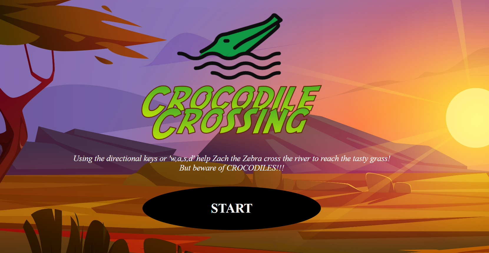
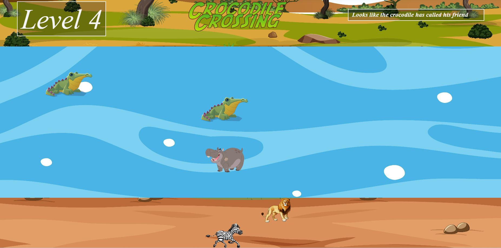
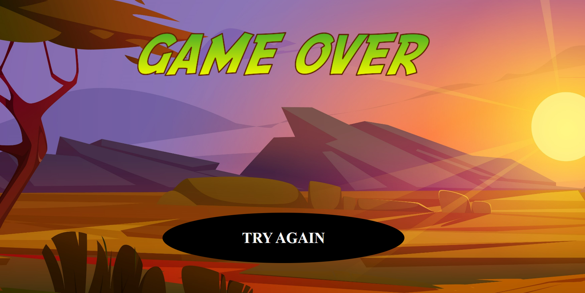

#CROCODILE CROSSING
***

***

###Intro
---
Welcome to the plains of Africa! Zach the zebra has run out of grass. He must cross the treacherous African river, filled with dangerous animals, to reach the otherside where the plains are filled with zebra food.  

###Gamplay
---

Using either the directional keys or 'w, a, s, d' move Zach the zebra in 4 directions to navigate past the unfriendly animals and get to the other side of the river.  
Crocodiles can move exactly the same way as Zach, but are confined to the river.  
Hippos can only move one space from their original position, befor next move having to return. 
Lions prowl the riverbank, but can only move left to right.  
Watch out though, one wrong move and its game over and Zach is someones lunch!

Good luck passing all 13 levels. 

###Play
---
Play the current version here [Crocodile Crossing](https://matthamilton49.github.io/Crocodile-Crossing/)